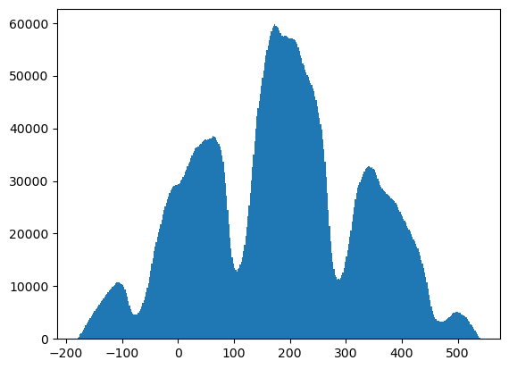
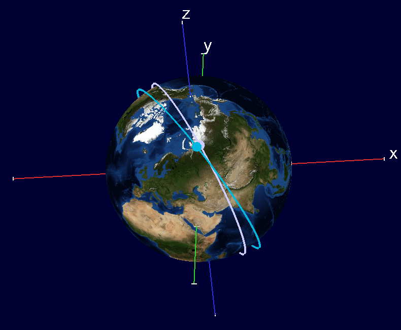
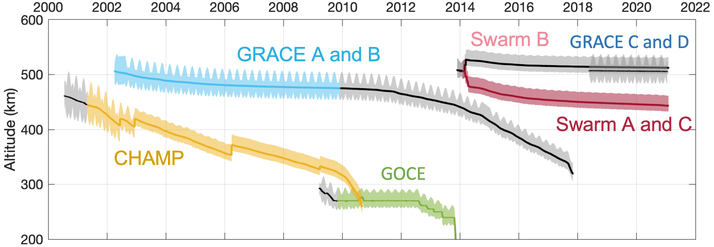
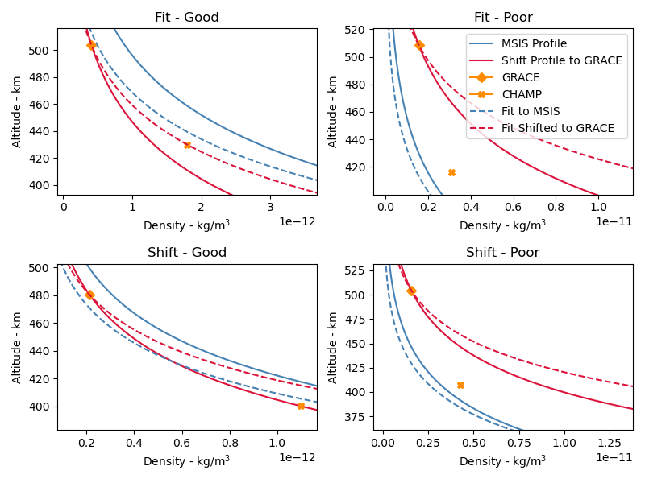
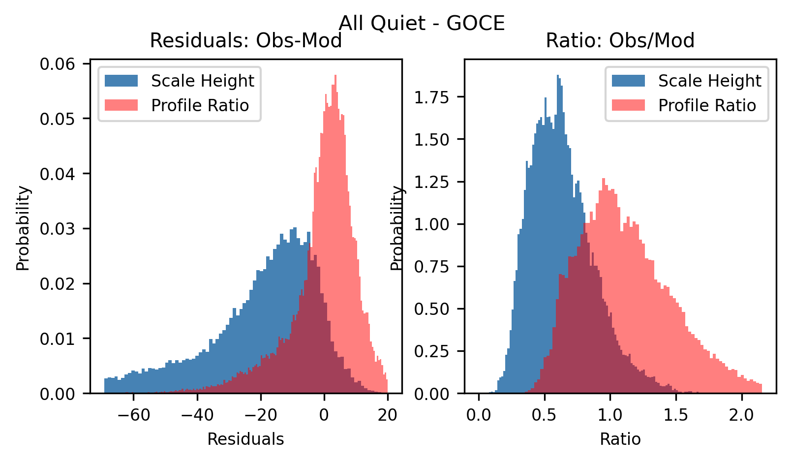
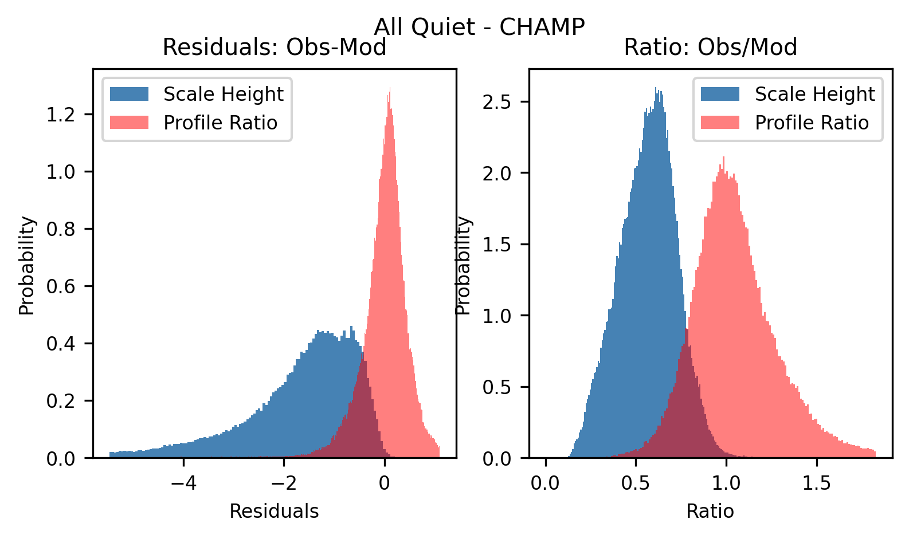
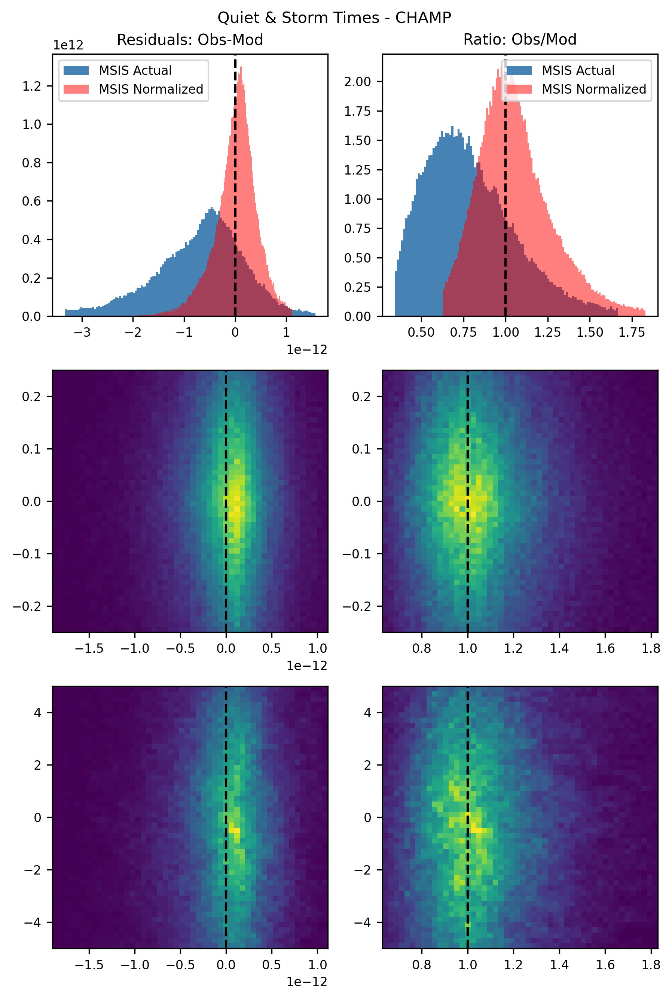
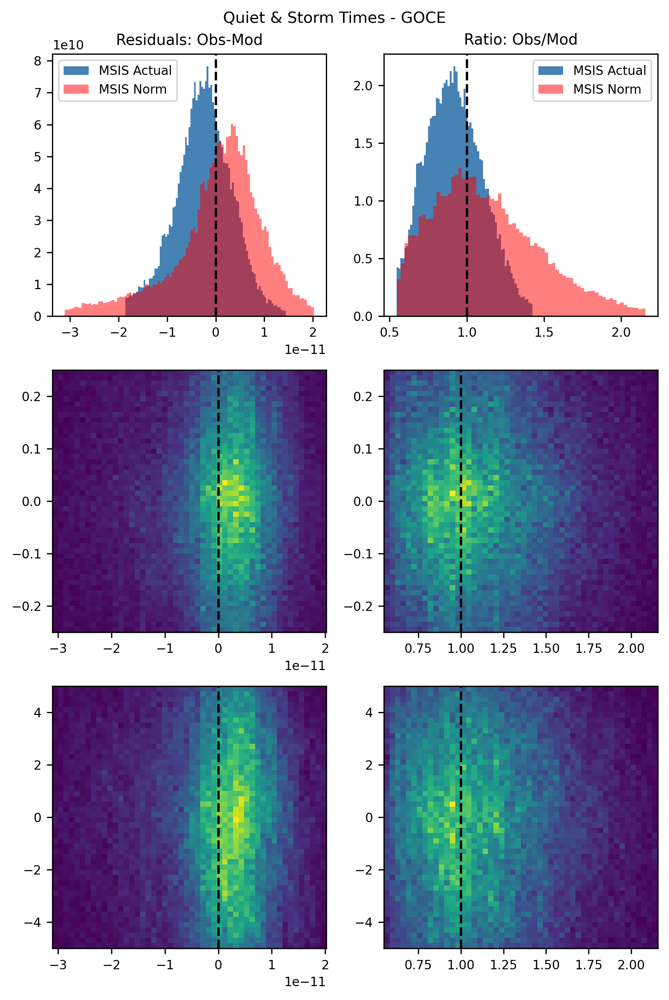

# Altitude Profiles

Test the best way to incorporate altitude into a single satellite density dataset. Density is obtained from [TOLEOS](http://thermosphere.tudelft.nl/index.html). 

Using MSIS (pymsis) modelled density profiles create a density profile at the location of the GRACE satellites. This will be done by _scaling_ the modeled density profile to the density the GRACE satellites.

Two methods will be tested: 

1. Shift method - Determine the ratio between the density at the altitude of GRACE B. Use this ratio to shift the MSIS density profile to match the observed density at the altitude of GRACE B. 
1. Fit method - Calculate the scale height from the MSIS model and apply this scale height to GRACE B data to derive an altitude profile. 

Both methods will be compared to CHAMP and GOCE data to determine the best method for deriving a density altitude profile from observations.

Density profiles will be drived for time periods when GRACE is in close proximity to either CHAMP or GOCE. The figure below is a histogram of the difference in longitude between GOCE and GRACE at conjugate points in time. Due to the difference in altitude of the spacecraft and precession of the orbits, this difference varies. However, there are a large number of points when the seperation is within $5^{\circ}$.

During periods when the spacecraft are close in longitude their still may be a large displacement in latitude. However, each orbit the spacecraft will come to similar latitudes within at most 90 minutes of eachother (roughly the period of the orbits). These times, when the spacecraft orbits are close in local time (longitude) and pass through similar latitudes, can be used to derive altitude profiles at GRACE and compare to the altitude at GOCE (and CHAMP).

It is important to note that as the spacecraft move along their orbit they can be very close in longitude at one point in time but far away at another point in time. To ensure the orbits are always close we can calculate the difference in longitude between the two spacecraft when they are at the same latitdue. 

An example of a point when GOCE and GRACE are close is shown below. Here at 2013-10-20 03:10:10 GOCE is at $74.6^{\circ}$ longitude and $58.6^{\circ}$ latitude. A few minutes later 2013-10-20 03:15:00 GRACE is at $74.1^{\circ}$ and $58.5^{\circ}$ latitude. 

For this study we derive altitude profiles at GRACE for periods of time when the GRACE satellite is within $5^{\circ}$ longitude $1^{\circ}$ latitude of either CHAMP or GOCE within a single GRACE orbit (90 minutes). This yeilds 69,216 conjunctions between GRACE and GOCE, and 202,046 conjunctions between GRACE and CHAMP. Note, MSIS can run in a normal mode and a geomagnetic storm mode. Here we have generated time-series of MSIS profiles using only the normal mode and then a mixed time-series where the geomagnetic storm mode is during storm-times using the our storm list. We compare the observed density to the two modeled densities using both time-series.   

## Comparisons of Methods

The figure below shows example of both methods used to derive altitude profiles from combining MSIS and GRACE data. The derived/modelled profililes are then compared to CHAMP observations. For both methods we consider a good fit (left) as well as a poor fit (right). 

()
The figures below show metrics comparing the two modelled densities with observed densities from GOCE and CHAMP.
- Top: quiet and storm-times
- Bottom: all quiet
- Left: Observed-Modelled (difference)
- Right: Observed-Modelled (ratio)

### GOCE

### CHAMP

### Discussion

- For both GOCE and CHAMP the ratio method works signifcantly better then the scale height method at predicting densities at lower altitudes then GRACE. This is because a single fixed scale height is not representitive of the density profile and thus the fit is not as good. While using the ratio provides a more accurate altidue profile and no functional form needs to be assumed. 
- For both CHAMP and GOCE there is very little difference in the Quiet/Storm and Quiet metrics (residuals and ratios).
- For both CHAMP and GOCE the normalization method tends to underestimate the desnity (residuals<0 and ratios>1). This is underestimation is exacerbated at lower altitudes (GOCE).

## Residual Analysis - Profile Method Only

The profile method has the best residuals of the two methods, but how do these residuals vary with the shift in latitude and longitude between the two satellites and how do these residuals compare to the actual MSIS profiles? 

### CHAMP

The residuals calculated from the normalized profiles are smaller and better distributed then those calculated using the actual MSIS profiles. There doesn't seem to be a significant variation with either delta latitude or longitude. 

### GOCE

Compared to CHAMP the residuals normalized profile are not as well organized. The difference have a longer tail but the ratios are more closely centered on 1. Overall the normalized profile residuals are wider.

### Metrics

CHAMP
| Metric | Profile Norm | MSIS | Exp |
|---|---|---|---|
| Median Absolute Error | **2.49** | 7.00 | E-13 |
| RMS | 3.05 | **1.75** | E-24 |
| Median Absolute Percent Error | **0.17** | 0.52 | X |
| Explained Variance | 0.56 | **0.82** | X |
| Correlation | 0.56 | **0.74** | X |

GOCE
| Metric | Profile Norm | MSIS | Exp |
|---|---|---|---|
| Median Absolute Error | 5.62 | **4.33** | E-11 |
| RMS | 13.1 | **5.50** | E-23 |
| Median Absolute Percent Error | 0.26 | **0.22** | X |
| Explained Variance | 0.49 | **0.81** | X |
| Correlation | 0.49 | **0.79** | X |

## Satellite Constelations

| Constellation | Altitude (km) |
|---|---|
| Project Kuiper | 590-630 |
| Starlink | 340-614 | 
| Telesat | 1300 | 
| Iridium | 780 | 
| GDC | 300-400 |
| OneWeb | 1200 |